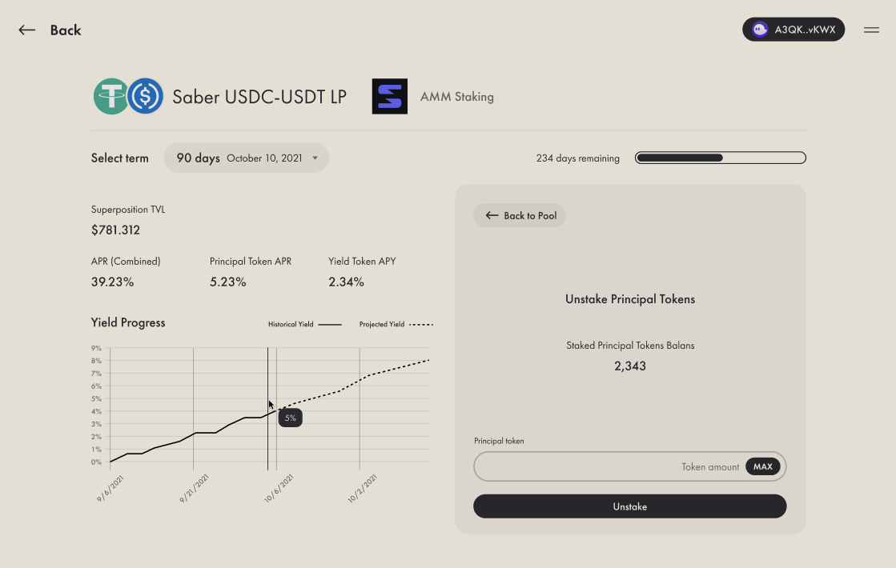

# Burning

After a vault has matured, all outstanding _**Principal and Yield Tokens**_ can be burned in order to unlock the original_** yield-generating tokens**_ that were used to mint them. 

The ratio at which the P_**rincipal and Yield Tokens**_ will redeem the _**yield-generating tokens**_ is determined at vault maturity through the following vault-wide formulas:

First we calculate the _Total Locked Originating Protocol Reserves_ held by the vault

$$
Op = Originating Protocol
$$

$$
LockedOpReserves = LockedOpTokensCount \cdot \frac{TotalReservesInOp}{TotalOpTokens}
$$

Secondly we calculate the _**Principal Tokens** Redeem Ratio_

$$
PrincipalTokensRR = \frac{LockedOpTokensCount}{LockedOpReserves}
$$

Finally, we calculate the _**Yield Tokens** Redeem Ratio_

$$
YieldTokensRR = PrincipalTokensRR \cdot \frac{LockedOpReserves - TotalPrincipalTokensMinted}{TotalYieldTokensMinted}
$$

Once these ratios are computed (automatically at vault expiration) all that is left for users to interact with the program in order to receive their Originating Protocol yield-generating tokens. This is accomplished in the Vault's page, which will enable the burning process once it has expired.  

